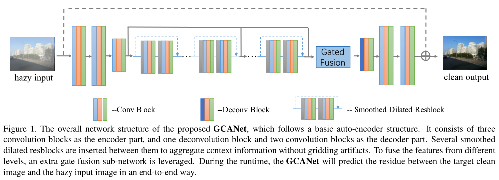

# Gated Context Aggregation Network for Image Dehazing and Deraining
* This is the implementation of our WACV 2019 paper"Gated Context Aggregation Network for Image Dehazing and Deraining"byDongdong Chen,Mingming He,Qingnan Fan,et al.

* Paper [Link](https://arxiv.org/pdf/1811.08747.pdf)
## Overview

# Datasets
* Rain1200[百度网盘 提取码: HZY6](https://pan.baidu.com/s/1P-ZMNxRkfdJvzAMLn60uRA)
* Rain1200[Gooledrive](https://drive.google.com/file/d/1cMXWICiblTsRl1zjN8FizF5hXOpVOJz4/view?usp=sharing)
* Download datasets and put it in the folder "Derain_datasets"

# Training
* python train.py

# Testing
* python eval.py

# Evaluation metrics
* ./scripts/PSNR.py
* ./scripts/SSIM.py

# Environment

	python >=3.6 
	pytorch >=1.5
	opencv-python >=4.0
	scipy >=1.4.0
	h5py >=2.10
	pillow >=7.0.0
	imageio >=1.18

